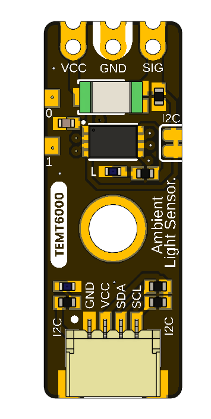

# UNIT ATOM TEMT6000 I2C Ambient Light Sensor

The **UNIT ATOM TEMT6000** is an I2C-compatible ambient-light sensor from
UNIT Electronics, the company that creates and develops the DevLab board
ecosystem. Atom is a product family within that ecosystem. Hardware V0.3.1
combines a TEMT6000 ambient-light phototransistor with an onboard interface
controller, Qwiic I2C routing, and direct analog signal access. The fitted
sensor manufacturer and exact orderable suffix have not been confirmed.

  

## Overview

| Feature | Description |
|---|---|
| Brand / company | UNIT Electronics |
| Board ecosystem | DevLab |
| Product family | Atom |
| Optical sensor | TEMT6000; fitted manufacturer/orderable part not confirmed |
| Interface controller | PY32F003, 32-bit Arm Cortex-M0+; 16 KB Flash, 2 KB SRAM, 24 MHz internal HSI application clock, no external oscillator |
| Host interfaces | Qwiic I2C and direct analog `SIG` |
| Nominal module supply | 3.3 V or 5 V; controller upper operating limit is 5.5 V |
| I2C operation | Factory address `0x20`; 7-bit slave, 100 kHz to 400 kHz |
| Qwiic signals | `GND`, `VCC`, `SDA/SWDIO`, `SCL/SWCLK`; debug aliases share the same physical port |
| Direct contacts | `VCC`, `GND`, `SIG` |
| Internal controller mapping | `PA2` sensor ADC, `PB5` built-in actuator, `PB6/SCL/SWCLK`, `PA10/SDA/SWDIO` |
| Expansion/service | Reserved `PA0`/`PA1`; reset and shared-port SWD are factory-only functions |
| Indicators | Power LED and firmware-controlled `BUILTIN` LED |
| Configuration | Solder bridge can be cut to disable I2C |
| Current board artwork | V0.3.1 |
| Current pinout | V3.1.0 |
| Manufacturer Part Number (MPN) | UE0098 |

The controller implements DevLab Device Protocol (DDP) v1.0. The TEMT6000
profile uses Device ID `0x0102` and command `TEMT6000_RAW` (`0x80`) to return a
12-bit ADC sample (`0` to `4095`) in an unsigned 16-bit little-endian response.
Clients discover the active I2C address and verify identity, protocol version,
firmware, hardware, and capabilities at runtime. The current controller firmware
reports firmware 1.0, hardware 1.0, and capabilities `0x000001B9`. It supports
background ADC averaging over 1, 4, 8, 16, or 24 samples. The V0.3.1 schematic
and complete module electrical limits remain pending.

`SWDIO` is the factory-debug function of the same `PA10` pin used as `SDA`, and
`SWCLK` shares `PB6` with `SCL`; there is no independent SWD port. These modes
are mutually exclusive. SWD/reset are reserved for the manufacturer, are not
recommended for users, and are not a supported firmware-replacement path.

## DevLab format compatibility

As part of the Atom family in the DevLab ecosystem, the module uses a compact,
standardized integration layout for rapid prototyping with DevLab sensor and
interface systems. Two optional horizontal 4-pin, 1.00 mm pitch JST/Qwiic
positions carry `GND`, `VCC`, `SDA`, and `SCL`; separate contacts retain direct
`VCC`, `GND`, and analog `SIG` access. The module supports nominal 3.3 V and
5 V operation. Compatibility still requires matching the host to the actual
I2C pull-up voltage, connector orientation, address, and bus loading.

## Interfaces

### Qwiic I2C

The pinout shows two optional horizontal 1.0 mm JST connector positions with
`GND`, `VCC`, `SDA`, and `SCL`. The board supports 3.3 V or 5 V nominal supply.
At 5 V, confirm that the host tolerates the bus pull-up level or use an I2C
level shifter; do not assume every 3.3 V Qwiic host is 5 V tolerant.

### Direct analog

The opposite end exposes `VCC`, `GND`, and `SIG`. `SIG` can be observed with a
high-impedance ADC or meter. Its current-board transfer function and maximum
range require the V0.3.1 schematic and validation; the legacy 10 kΩ formula is
not promoted to a V0.3.1 guarantee.

## Repository

- [Hardware overview](hardware/README.md)
- [Product Reference source](tools/product-reference/README.md)
- [C++ and MicroPython examples](software/examples/README.md)
- [MicroPython I2C examples and reusable DDP module](software/examples/i2c/micropython/README.md)
- [DDP device profile](software/protocol/README.md)
- [English pinout V3.1.0](hardware/unit_pinout_v_3_1_0_ue0098_temt6000_ambient_light_sensor_en.pdf)
- [Spanish pinout V3.1.0](hardware/unit_pinout_v_3_1_0_ue0098_temt6000_ambient_light_sensor_es.pdf)
- [Legacy analog schematic V0.0.1](hardware/unit_sch_V_0_0_1_ue0098_TEMT6000.pdf)
- [Reference TEMT6000X01 datasheet — Vishay; not proof of the fitted manufacturer](https://www.vishay.com/docs/81579/temt6000.pdf)

## Documentation status

Before production use, release the V0.3.1 schematic, complete module electrical
limits, and current mechanical drawing. Chapter 9 of the Product Reference
tracks the remaining gaps and current firmware limitations explicitly.

## License

See [LICENSE](LICENSE).
