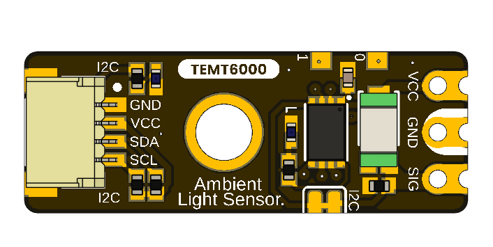

# DevLab: I2C TEMT6000 Ambient Light Sensor

The **DevLab I2C TEMT6000 Ambient Light Sensor** is a small ambient light sensor module that contains the **TEMT6000 phototransistor** and a **microcontroller**.This version has a **I2C interface** that allows the sensor signal to be captured, processed and accessed digitally from an I2C host, unlike a typical TEMT6000 module which only offers an analog output.

The module also includes a dedicated header for direct access to the **raw sensor signal** allowing the TEMT6000 output to be used directly for analog measurements, testing, characterization or custom signal processing. The board has three I2C connections, which makes it easy to integrate with other DevLab modules and I2C based systems.

  

### Quick Setup

## Overview

| Feature | Description |
|---|---|
| Sensor | TEMT6000 Ambient Light Sensor |
| Sensor Type | Ambient light phototransistor |
| Onboard MCU | 32-bit Arm Cortex-M0+ |
| Main Interface | I2C |
| Raw Signal Access | Direct sensor signal available through dedicated header |
| I2C Connectivity | 3 I2C connectors |
| Status Indicators | Power and user/status LEDs |
| Debug / Test | Dedicated test points |
| Module Function | Ambient light acquisition and I2C sensor interface |

## How It Works

The **TEMT6000** phototransistor generates a signal according to the incident ambient light level.

This signal is connected directly to the onboard **microcontroller**, which can acquire and process the sensor output and make the resulting information available through the **I2C interface**.

The board also exposes the sensor signal through the **RAW Signal Header**, allowing direct access to the unprocessed TEMT6000 output independently of the I2C interface.

This architecture provides two ways to work with the sensor:

- **I2C interface:** Easy digital integration with microcontrollers and other I2C systems.
- **RAW signal:** Direct access to the sensor output for analog measurements, testing, or custom processing.

## Use Cases

- Ambient light monitoring.
- Automatic display brightness adjustment.
- Smart lighting systems.
- Home and industrial automation.
- IoT environmental monitoring.
- Light-level data logging.
- Educational and prototyping applications.
- Sensor characterization using the RAW signal output.
- Integration into I2C sensor networks.

## Resources

- [Schematic Diagram](https://github.com/UNIT-Electronics-MX/unit_devlab_temt6000_ambient_light_sensor/blob/main/hardware/unit_sch_v_2_0_0_ue0098_temt6000.pdf)

- [Pinout Diagram](https://github.com/UNIT-Electronics-MX/unit_devlab_temt6000_ambient_light_sensor/blob/main/hardware/unit_pinout_v_0_0_2_ue0098_temt6000_ambient_light_sensor_en.pdf)

- [Datasheet](https://github.com/UNIT-Electronics-MX/unit_devlab_temt6000_ambient_light_sensor/blob/main/hardware/unit_datasheet_v_1_0_0_ue0098_temt6000_ambient_light_sensor_en.pdf)

## License

All hardware and documentation in this project are licensed under the **MIT License**.

Please refer to [`LICENSE.md`](LICENSE.md) for full terms.

  Developed by UNIT Electronics

