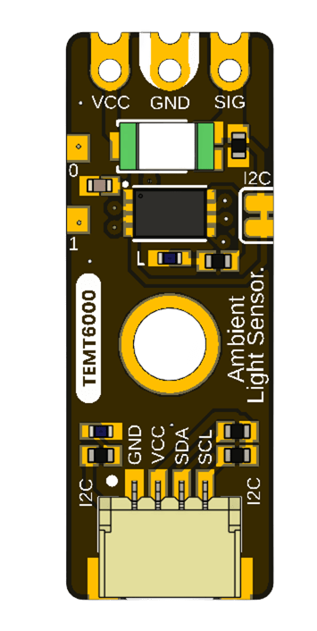
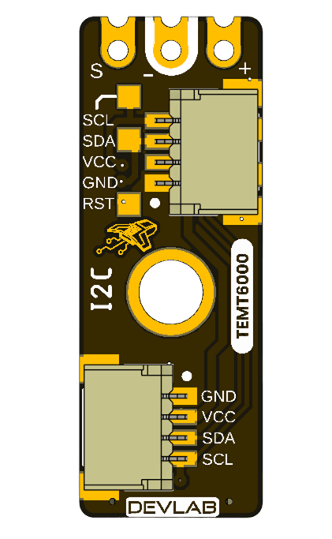

# Hardware

## UNIT ATOM TEMT6000 V0.3.1

UNIT Electronics creates and develops the DevLab board ecosystem; UE0098
belongs to its Atom family. The current board combines a TEMT6000 ambient-light
phototransistor with an onboard interface controller. The sensor's fitted
manufacturer and exact orderable suffix have not been confirmed. It provides
Qwiic I2C connectivity, direct analog access, auxiliary pads, indicators,
factory-only reset/SWD functions multiplexed with the I2C port, and a solder
bridge for disabling I2C.

  
  

## Current Interfaces

### Qwiic I2C

| Signal | Function | Status |
|---|---|---|
| `GND` | Common return | Defined by V3.1.0 pinout |
| `VCC` | Module supply | 3.3 V or 5 V nominal; controller upper operating limit is 5.5 V |
| `SDA` / `SWDIO` | I2C data / factory debug data | Same physical controller pin `PA10`; I2C and SWD use are mutually exclusive |
| `SCL` / `SWCLK` | I2C clock / factory debug clock | Same physical controller pin `PB6`; 100 kHz to 400 kHz in I2C mode |

Two optional horizontal 1.0 mm JST connector positions, A and B, are shown.
Confirm which connector is populated and its orientation on the ordered
assembly.

### Direct and Service Access

| Label | Function | Status |
|---|---|---|
| `VCC`, `GND`, `SIG` | Direct sensor power/reference/signal | V0.3.1 analog transfer not released |
| `PA0`, `PA1` | GPIO / auxiliary pads | No current application; reserved for future use |
| `RESET` | Controller reset | Factory service; not intended for routine user operation |
| `SWDIO`, `SWCLK` aliases | Controller debug | No separate SWD port; aliases share `SDA`/`SCL` and are factory-only |
| `POWER` | Power indicator | Circuit details require the current schematic |
| `BUILTIN` | Firmware indicator | Driven internally by controller pin `PB5` |
| I2C solder bridge | Cut to disable I2C | Exact isolation boundary needs current schematic |

## Available Technical Sources

| Source | Applies to | Limitation |
|---|---|---|
| [English pinout V3.1.0](unit_pinout_v_3_1_0_ue0098_temt6000_ambient_light_sensor_en.pdf) | Current visible interfaces | No contact numbers or electrical limits; DDP profile is documented separately |
| [Spanish pinout V3.1.0](unit_pinout_v_3_1_0_ue0098_temt6000_ambient_light_sensor_es.pdf) | Current visible interfaces | Same limitations |
| V0.3.1 top/bottom renders | Current placement and identification | Not controlled mechanical drawings |
| [Schematic V0.0.1](unit_sch_V_0_0_1_ue0098_TEMT6000.pdf) | Legacy analog-only module | Does not contain the V0.3.1 controller or I2C circuit |
| [Vishay document 81579](https://www.vishay.com/docs/81579/temt6000.pdf) | Comparative TEMT6000X01 reference only | Does not identify the fitted manufacturer or rate the complete module |

## DDP Identity and Data

The onboard firmware uses DevLab Device Protocol v1.0. Its logical identity is
Device ID `0x0102`, independent of the active I2C address. A host must perform
DDP discovery, inspect capabilities, and read `TEMT6000_RAW` (`0x80`) for a
12-bit ADC sample encoded as unsigned 16-bit little endian. The address can be
read or changed with the common DDP I2C-configuration commands when the
corresponding capability is advertised. The current firmware uses factory
address `0x20`, firmware/hardware 1.0, and capability bitmap `0x000001BB`.

The TEMT6000 analog signal is sampled internally by the controller on `PA2`.
It is mapped to logical `ADC0`: `READ_ADC0` (`0x60`) and `TEMT6000_RAW` (`0x80`)
return the same published sample. `GPIO0` is the read-only state of controller
`PA4`. Controller `PB5` drives `BUILTIN`; exposed `PA0` and `PA1` are currently
unassigned.

The module is a 7-bit I2C slave and supports bus clocks from 100 kHz through
400 kHz. `PB5/BUILTIN` uses the relay-compatible commands `RELAY_OFF`,
`RELAY_ON`, and `RELAY_TOGGLE` (`0xA0..0xA2`). Digital-output commands
`0x42/0x43` are not implemented.

## PY32F003 Controller

The onboard interface controller has a 32-bit Arm Cortex-M0+ core. This
application runs at a maximum of 24 MHz from the internal high-speed oscillator
(`HSI`) and does not use an external oscillator or crystal (`HSE`). It provides
a 12-bit ADC whose input range is `0..VCC`, and an I2C peripheral supporting
7-bit addressing at 100 kHz and 400 kHz. Procurement records do not confirm the
fitted controller suffix. To
publish one conservative voltage range, this product documentation adopts the
x7 limit of 2.0 V to 5.5 V; this includes nominal 3.3 V and 5 V operation but
does not identify the physical device as x7. No controller or module
temperature rating is claimed without assembly traceability and qualification.

## TEMT6000 Reference Characteristics

These published TEMT6000X01 values are retained only as a comparative
reference. They are not guaranteed characteristics of the fitted sensor or
the complete module because its manufacturer and exact orderable part have
not been confirmed.

| Parameter | Min. | Typ. | Max. | Unit |
|---|---:|---:|---:|---|
| Light current at 20 lx, 5 V, CIE illuminant A | 3.5 | 10 | 16 | µA |
| Light current at 100 lx, 5 V, CIE illuminant A | — | 50 | — | µA |
| Dark current at 5 V | — | 3 | 50 | nA |
| Peak sensitivity wavelength | — | 570 | — | nm |
| Half-sensitivity spectral bandwidth | 440 | — | 800 | nm |
| Angle of half sensitivity | — | ±60 | — | degrees |

## Engineering Precautions

- Use a current-limited 3.3 V or 5 V supply for initial evaluation; do not
  exceed the controller upper operating limit of 5.5 V.
- At 5 V, confirm that the I2C host tolerates the actual pull-up level or use a
  bidirectional level shifter.
- Because the ADC range is `0..VCC`, verify `SIG` before connecting it to a
  host ADC with a lower full-scale voltage.
- Do not connect an SWD probe or attempt to replace the firmware. SWD/reset are
  reserved for the manufacturer and advanced factory diagnostics. Factory SWD
  access requires I2C to be inactive and isolated because both share the port.
- Do not cut the I2C bridge with the board powered.
- Do not use the old V0.0.1 dimensions for the longer V0.3.1 board.
- Obtain the V0.3.1 schematic and complete module electrical limits before
  production; account for the firmware limitations documented in the DDP
  profile.
