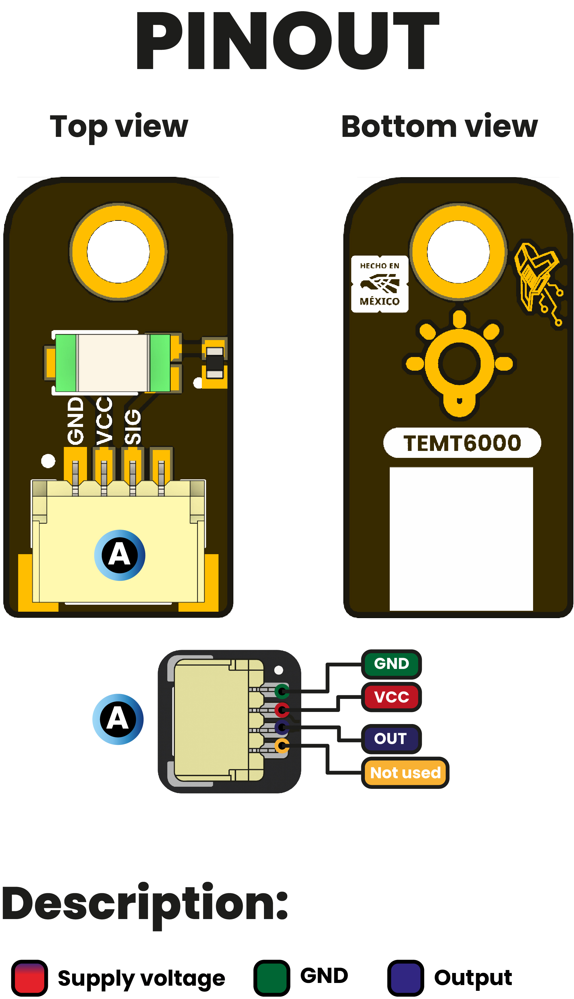

# Hardware

<a href="./unit_sch_v_2_0_0_ue0098_temt6000.pdf">
  
   Schematics
</a>

---

## Key Technical Specifications

### Connectivity

| Interface | Details |
|-----------|---------|
| **Primary Interface** | I2C |
| **Sensor Interface** | TEMT6000 analog signal |
| **Raw Signal Access** | Dedicated RAW Signal Header |
| **I2C Connectors** | 3 × JST 4-pin, 1.0 mm pitch |
| **I2C Lines** | SDA, SCL |
| **Onboard MCU** | PY32F003L24D6TR |
| **I2C Pull-ups** | 10 kΩ |
| **Status Indicators** | Power LED and User LED |
| **Debug / Test** | Dedicated test points |

## Technical Specifications

The UE0098 integrates a **TEMT6000 ambient light sensor** with a
**PY32F003L24D6TR microcontroller**, which acts as the interface between
the sensor signal and the I2C bus.

The TEMT6000 output is available to the onboard microcontroller for
signal acquisition and processing. The same sensor signal is also
exposed through a dedicated **RAW Signal Header**, allowing direct access
for measurement, testing, characterization, or external processing.

### I2C Interface

| Signal | Type | Description |
|:------:|------|-------------|
| VCC | Power | Module power supply |
| GND | Power | Ground reference |
| SDA | I/O | I2C serial data |
| SCL | Input | I2C serial clock |

The board provides **three I2C connectors** connected to the same bus,
allowing convenient integration with other compatible I2C modules.

### RAW Signal Header

| Signal | Type | Description |
|:------:|------|-------------|
| VCC | Power | Module supply voltage |
| GND | Power | Ground reference |
| SIGNAL | Analog | Direct TEMT6000 sensor signal |

> **Note:** The RAW Signal Header provides direct access to the TEMT6000
> sensor signal independently of the I2C interface.

## TEMT6000 Electrical Characteristics

The following characteristics correspond to the **TEMT6000 sensor**
itself and should not be interpreted as electrical limits for the
complete UE0098 module.

| Symbol | Description | Min | Typ | Max | Unit |
|--------|-------------|-----|-----|-----|------|
| V_CEO | Collector-emitter voltage | - | - | 6 | V |
| I_C | Collector current | - | - | 20 | mA |
| V_ECO | Emitter-collector voltage | - | - | 1.5 | V |
| P_V | Power dissipation | - | - | 100 | mW |
| φ | Angle of half sensitivity | - | ±60 | - | deg |
| λ_P | Wavelength of peak sensitivity | - | 570 | - | nm |
| λ_0.5 | Spectral bandwidth range | 440 | - | 800 | nm |

> **Note:** Refer to the Vishay TEMT6000 datasheet for complete sensor
> electrical and optical characteristics.

## Pinout

<a href="./unit_pinout_v_3_1_0_ue0098_temt6000_ambient_light_sensor_en.pdf">
  
   Pinout
</a>

  

### Pinout Details

#### I2C Connectors

| Pin Label | Function | Description |
|-----------|----------|-------------|
| VCC | Power Supply | Module power supply |
| GND | Ground | Common ground reference |
| SDA | I2C Data | Serial data line |
| SCL | I2C Clock | Serial clock line |

#### RAW Signal Header

| Pin Label | Function | Description |
|-----------|----------|-------------|
| VCC | Power Supply | Module power supply |
| GND | Ground | Common ground reference |
| SIGNAL | Raw Sensor Signal | Direct TEMT6000 output signal |

## Topology

<a href="./resources/unit_topology_V_0_0_1_ue0098_TEMT6000.png">
  
   Topology
</a>

| Ref. | Description |
|------|-------------|
| TEMT6000 | Ambient Light Sensor |
| IC1 | PY32F003L24D6TR I2C Driver / Microcontroller |
| J1, J3, J4 | I2C JST 4-pin, 1.0 mm pitch connectors |
| J2 | RAW Signal Header |
| PWR | Power status LED |
| USR_LED | User / status LED |
| TP | Test points |

## Hardware Architecture

The module uses the following signal architecture:

**TEMT6000 → Raw Sensor Signal → PY32F003 → I2C**

The TEMT6000 generates an analog signal according to the incident light
level. This signal is acquired by the onboard PY32F003 microcontroller,
which can process the sensor information and expose it through the I2C
interface.

In parallel, the unprocessed sensor signal remains available through the
**RAW Signal Header**:

**TEMT6000 → RAW Signal Header**

This architecture allows the module to be used both as an I2C ambient
light sensor and as a platform for direct access to the TEMT6000 signal.

## Dimensions

<a href="./resources/unit_dimension_V_0_0_1_ue0098_TEMT6000.png">
  
   Dimensions
</a>

## Reference

- [TEMT6000 Datasheet](https://www.vishay.com/docs/84374/temt6000.pdf)