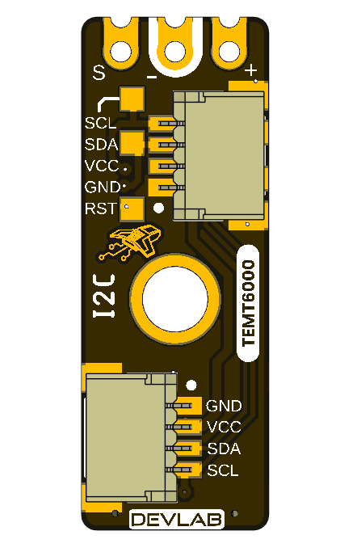

## **1 The Board**

The design supports two host paths. A Qwiic-capable controller can attach
through the I2C positions, while an ADC-capable host or test instrument can
sample the exposed `SIG` contact directly. Factory debug reuses the same
controller pins and physical port as I2C; it is not a separate user interface.

### **1.1 Accessories** {.section-page}

No accessory bundle is specified. Typical integration items are:

| Accessory | Purpose | Selection notes |
|---|---|---|
| Qwiic cable | Connects `GND`, `VCC`, `SDA`, and `SCL` | Verify 1.0 mm pitch, orientation, and contact order; connectors are shown as optional |
| I2C-capable host | Scans and communicates with the module | Use 7-bit addressing and a clock from 100 kHz through 400 kHz |
| Analog test lead or carrier | Accesses `VCC`, `GND`, and `SIG` | `SIG` must connect to a voltage-compatible ADC input |
| Logic analyzer | Checks I2C activity | Use input thresholds compatible with the powered board |
| Reference lux meter | Supports optical calibration | Required for quantitative illuminance validation |

### **1.2 Board Identification**

| Item | Value |
|---|---|
| Product | UNIT ATOM TEMT6000 Ambient Light Sensor |
| Brand / company | UNIT Electronics |
| Board ecosystem | DevLab |
| Product family | Atom |
| Product type | I2C-compatible and direct-analog ambient-light module |
| Optical component | TEMT6000 |
| Interface controller | 32-bit Arm Cortex-M0+; 16 KB Flash and 2 KB SRAM; fitted suffix not asserted |
| Manufacturer Part Number (MPN) | UE0098 |
| Current board artwork | |
| Available schematic | Current hardware schematic V2.0.0 |
| Product Reference | Version 1.1.0 |

Board, pinout, schematic, and documentation revisions are controlled
independently.

### **1.3 Identified Assemblies**

| Assembly | Function | Source status |
|---|---|---|
| TEMT6000 sensor | Converts visible light to photocurrent | Functional identity shown by board/pinout artwork; manufacturer and exact suffix unconfirmed |
| Interface controller | Samples or processes the sensor for I2C access | 32-bit Arm Cortex-M0+; 16 KB Flash and 2 KB SRAM; exact fitted variant not confirmed; conservative controller voltage guidance is 2.0–5.5 V |
| Qwiic positions A and B | I2C power and bus access | Shown as optional horizontal JST connectors |
| Direct contacts | `VCC`, `GND`, and analog `SIG` | Identified on the top view |
| I2C disable bridge | Disconnects or disables I2C when cut | Function identified; exact circuit unspecified |
| Power and built-in LEDs | Power and firmware indication | `BUILTIN` is driven by controller `PB5` |
| PA0/PA1 and service functions | Reserved GPIO and factory reset/debug | `PA0`/`PA1` have no current application; SWD aliases share the I2C port |
| Internal controller mapping | `PA2` ADC, `PB5` built-in actuator, `PB6/SCL/SWCLK`, `PA10/SDA/SWDIO` | Current firmware/hardware mapping |

### **1.4 Board Topology** {.section-page}

{width=7.0in}

**Figure 1.1 — V3.1.0 board topology with top- and bottom-side reference
designators.**

The topology identifies the direct-contact header `J2`, Qwiic positions `J1`
and `J3`, side connector `J4`, I2C-disable bridge `JP1`, sensor `Q1`,
controller `IC1`, indicator LEDs, and service test points. Use the released
schematic and pinout for electrical connectivity and signal definitions.

| Ref. | Description |
|---|---|
| `TEMT6000` | Ambient Light Sensor |
| `IC1` | PY32F003L24D6TR I2C Driver / Controller |
| `J1`, `J3`, `J4` | I2C JST 4-pin, 1.0 mm pitch connectors |
| `J2` | RAW Signal Header |
| `PWR` | Power status LED |
| `USR_LED` | User / status LED |
| `TP` | Test points |

### **1.5 Board Views** {.section-page}

{width=2.35in}

The top view shows the direct sensor contacts, controller, sensor, mounting
hole, indicator circuitry, and one Qwiic connector position.

{width=2.35in}

The bottom view labels Qwiic, the SWD aliases on that same port, reset, and the
second optional connector position.

### **1.6 Handling** {.section-page}

Use normal ESD precautions. Keep the transparent sensor package clean and
optically unobstructed. Remove power before changing connectors or modifying
the I2C solder bridge. Do not attach an SWD probe or attempt to replace the
firmware. SWD/reset access is reserved for the manufacturer and advanced
factory diagnostics; I2C must be inactive and isolated before factory SWD use.
