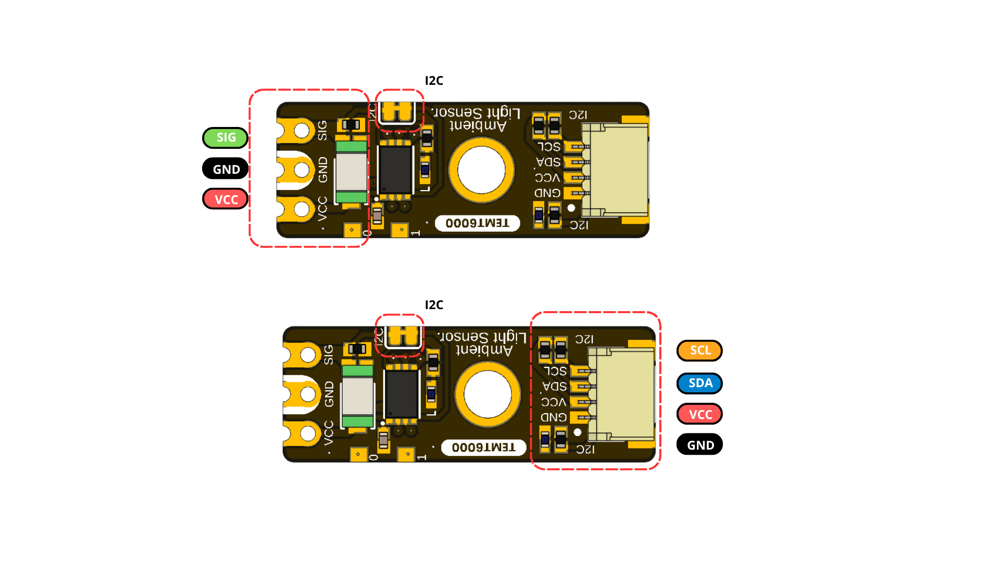

## **4 Connectors & Pinouts**

The user-accessible interfaces are described below by module function. The
released documentation does not provide controlled contact numbers or a
mating-connector part number, so the signal order must be checked against the
connector orientation before producing a harness.

### **4.1 General Pinout** {.section-page}

| Connection group | Signals | Function |
|---|---|---|
| Direct sensor contacts | `VCC`, `GND`, `SIG` | Module power and direct access to the TEMT6000 analog signal |
| I2C connection positions | `GND`, `VCC`, `SDA`, `SCL` | Power and digital communication over the common I2C bus |
| Reserved expansion pads | Reserved | No current application assignment; electrical limits are not specified |

The PCB has three physical I2C connection positions. One connector is
populated by default, and two additional horizontal positions accept optional
4-pin, 1.00 mm-pitch JST/Qwiic-compatible connectors. All three positions are
connected to the same I2C bus.

### **4.2 Signal and I2C Connection Guide** {.page-break}

{width=6.8in}

**Figure 4.1 — Direct analog and I2C connection groups.** The direct contacts
provide `SIG`, `GND`, and `VCC`; the populated I2C connector provides `SCL`,
`SDA`, `VCC`, and `GND`. Always follow the connector orientation shown on the
board.

### **4.3 Direct Sensor Contacts**

| Label | Type | Description |
|---|---|---|
| `VCC` | Power | Module supply; nominal 3.3 V or 5 V operation |
| `GND` | Power | Common power and signal reference |
| `SIG` / `SIGNAL` | Analog | Direct light-dependent sensor signal; current transfer function unspecified |

These three contacts are shown at the end opposite the populated I2C
connector. `SIG` provides direct access to the TEMT6000 analog signal; it is
not a separate specialized communication port.

### **4.4 I2C Connection Positions** {.section-page}

| Signal | Type | Description |
|---|---|---|
| `GND` | Power | Common return |
| `VCC` | Power | I2C peripheral supply; nominal 3.3 V or 5 V |
| `SDA` | Bidirectional I2C data | Host must tolerate the actual bus pull-up voltage |
| `SCL` | I2C clock | Supported at 100 kHz to 400 kHz |

The two optional horizontal I2C connector positions use the same signal set
and 1.00 mm pitch as the populated connector. Because all three positions are
physical access points to the same bus, an optional connector may be used for
an alternate cable orientation or bus continuation. Account for the loading
and pull-ups of every attached device.

The I2C connection points share signals with the controller's factory
programming and debugging interface. These functions are mutually exclusive,
and there is no separate user-accessible SWD connector.

### **4.5 Auxiliary and Factory Service Functions**

| Function | Documented role | Qualification status |
|---|---|---|
| Reserved expansion pad 1 | Reserved connection | No current application assignment; electrical limits unspecified |
| Reserved expansion pad 2 | Reserved connection | No current application assignment; electrical limits unspecified |
| Controller reset | Factory service function | Manufacturer programming and factory diagnostics only |

Programming, debugging, and reset are not user interfaces, and the product is
not documented for user firmware replacement. During manufacturer programming
or factory diagnostics, I2C must be inactive and other bus devices must be
isolated from the shared signals.

### **4.6 Indicators and I2C Bridge**

The module provides a power indicator, a firmware-controlled built-in status
indicator, and a cuttable bridge used to disable I2C operation. Indicator
polarity and current, along with the bridge's complete electrical behavior,
require confirmation from the released schematic and module-level validation.
The controller ADC input used for sensor acquisition is internal to the module
and is not an additional external contact.
