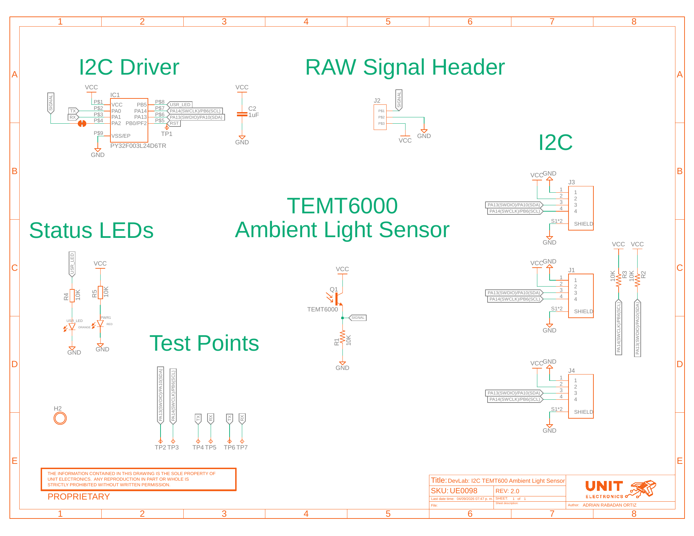

## **9 Appendix**

### **9.1 Current V2.0.0 Schematic** {.section-page}

The current schematic is documented in
`hardware/unit_sch_v_2_0_0_ue0098_temt6000.pdf`. It documents the
controller-based V0.3.1 board, including the PY32F003L24D6TR, TEMT6000 analog
stage, I2C interfaces, status LEDs, test points, and optional connectors.

{width=7.0in}

**Figure 9.1 — Current V2.0.0 electrical schematic.**

The sensor signal uses a 10 kΩ resistor (`R1`) to ground and is routed to
controller `PA2`/ADC0 and the RAW Signal Header. The I2C bus uses
`PA10/SDA` and `PB6/SCL`, with the same physical lines reserved for factory
SWD aliases.

### **9.2 Document Control** {.section-page}

| Field | Value |
|---|---|
| Product | UNIT ATOM TEMT6000 Ambient Light Sensor |
| Product hierarchy | UNIT Electronics → DevLab board ecosystem → Atom family |
| Manufacturer Part Number (MPN) | UE0098 |
| Current board artwork | V0.3.1 |
| Current pinout | V3.1.0 |
| Current topology and dimensions | V3.1.0 |
| Available schematic | Current V2.0.0 |
| Product Reference | Version 1.1.0 |
| Publication date | 2026-08-31 |
| Interfaces | Qwiic I2C with shared factory SWD, analog, and auxiliary pads |

### **9.3 Required Technical Releases**

- V0.3.1 bill of materials
- Exact controller package/ordering suffix, released firmware image, and update procedure
- Exact oscillator/timing tolerances and uniform future DDP status behavior
- Complete-module supply/logic absolute-maximum ratings and current consumption
- Pull-up values and bus-loading limits
- Direct `SIG` transfer, loading, range, and ADC guidance
- Mechanical tolerances, board thickness, component heights, and finished mass
- Module-level optical, electrical, environmental, and EMC characterization
